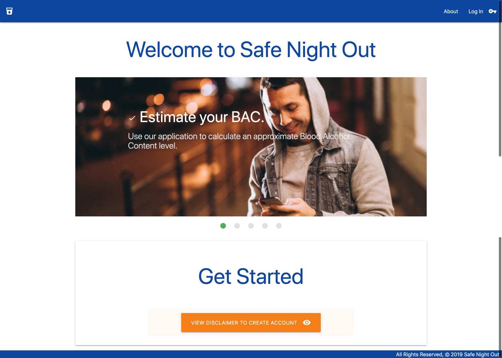
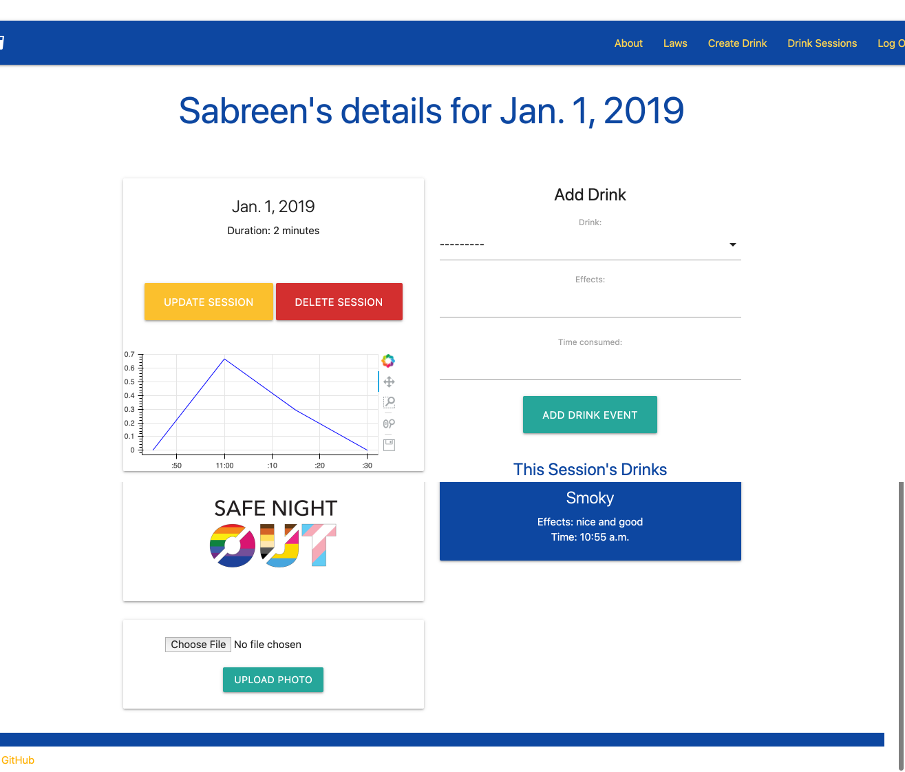

# Safe Night Out

Created By | Last Updated
-----------|--------------
Salma Khan | January 3, 2020
Alban Xhaferllari | January 3, 2020
Alex Perkowski | January 3, 2020
Gerardo Mendoza | January 3, 2020

Safe Night Out is a remote collaborative group project created by Alban Xhalferalli, Gerardo Mendoza, Alexander Perkowski, and Salma Khan from Austin & Dallas, TX. The purpose of this application is to do the following: 
* Track what you drink in real time.
* Calculate an approximate Blood Alcohol Content level.
* Build healthy drinking habits.
* Upload pictures from your drinking sessions. 
* Use our application to drink responsibly and get home safely.
* Understand Texas drinking laws. 

## User Stories 
* As a user (AAU), when I land in the app I should be able to see an option ether to Sign Up or Log In. 
    * I see also see a navigation bar and be able to go to "About" page that tells me about the app and how to use it.
* AAU, I want to have a user profile based on the login information. 
* AAU, I want to add all my drinking sessions in a list.
* AAU, I want to be able to create, update, and delete a drink. 
* AAU, I want to be able to add new drink session and be able to edit and delete it if I change my mind later on.   
* AAU, I want to be able to upload photos from my drinking sessions. I want to see a "No Photos Uploaded" message if there are no images for the session.
* AAU, I want to be able to calculate my Blood Alcohol Content level.
* AAU, I want to see how drinks affect me based on my body weight, gender, or other factors.
* AAU, I want to see a visual graph of my Blood Alcohol Content level.  

## Technologies Used
* Django
* Python
* PostgreSQL
* Template Inheritance (Partials)
* Amazon Web Services(AWS)
* Django Authentication
* Materialize CSS Framework
* Django Template Language (DTL)

## Link to the deployed application in Heroku
[Safe Night Out](http://saf3nightout.herokuapp.com/)

## Link to Trello board
[Trello Board](https://trello.com/b/eobNgEkN/project-3)

## Link to wireframe 
[Wireframe](https://pr.to/9951J5/)

## Link to pitch deck 
[Pitch deck presentation](https://docs.google.com/presentation/d/1j0e2z1oQUXVFTgXBdu9JAL2-PfTUG1YLmCuoOb15XcQ/edit#slide=id.g7bbe74316e_2_85)